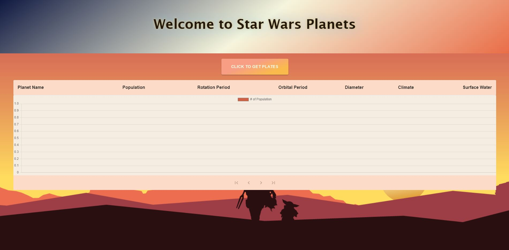

# Welcome to Star Wars Planets

This project is for getting planets' information from [Star Wars API](https://swapi.py4e.com/api/planets/).

## Overview
 

## Available Scripts

In the project directory, you can run:

### `npm install`

Install the package and it's dependencies.

### `npm start`

Runs the app in the development mode.\
Open [http://localhost:3000](http://localhost:3000) to view it in the browser.

The page will reload if you make edits.\
You will also see any lint errors in the console.